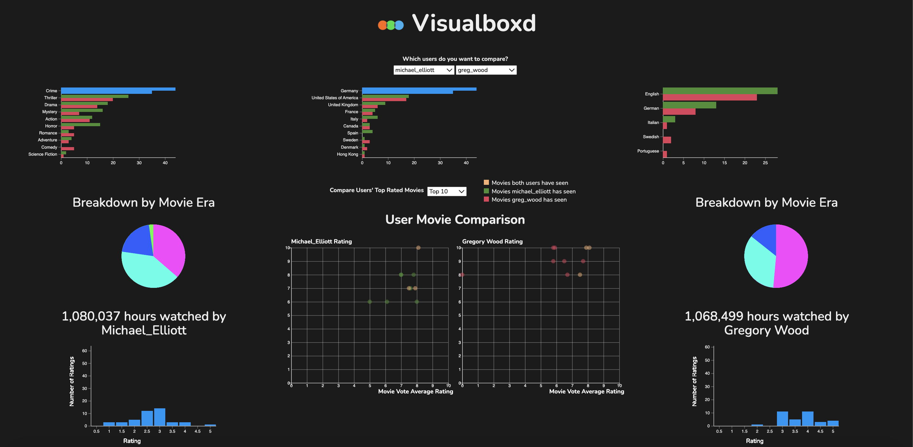

# Visualboxd or: How I Learned to Stop Worrying and Love Visualization

Letterboxd is a self-described “social platform for grass-roots film discussion and discovery”, boasting over 3 million users cataloging their thoughts on nearly half a million movies that span the full spectrum of time, genre, and taste since the advent of motion pictures. However, we know what using Letterboxd is really about: an opportunity for you to show off your superior taste compared to your friend Mark who religiously watches Christopher Nolan’s Batman trilogy on loop. To help you pull off such a stunt, we have created an app visualizing the taste of the top contributors to Letterboxd.

